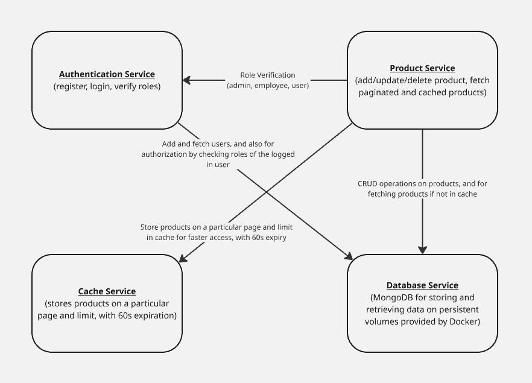

# E-Commerce Microservices Backend

## About the Project

This is a microservices-based e-commerce backend application designed with modularity and scalability in mind. Each service handles a distinct responsibility—user authentication, product management, data storage, and caching. Services communicate over HTTP and are containerized using Docker. Redis is used for caching frequently accessed product data, and MongoDB serves as the main database for both user and product data.

---

## Directory Structure

```
ecommerce-backend/
├── docker-compose.yml      # Orchestration of all services
├── .gitignore              # Ignore node_modules, .env, etc.
├── architecture-diagram.png
├── authentication/         # Authentication microservice
│ ├── db.js                 # MongoDB connection
│ ├── index.js              # Entry point for auth-service
│ ├── userModel.js          # Mongoose schema for users
│ ├── Dockerfile            # Dockerfile for auth-service
│ ├── package.json          # Node.js dependencies
│ └── .env                  # Auth-specific environment variables
│
├── product/                # Product microservice
│ ├── db.js                 # MongoDB connection
│ ├── index.js              # Entry point for product-service
│ ├── productModel.js       # Mongoose schema for products
│ ├── redis.js              # Redis client for caching
│ ├── Dockerfile            # Dockerfile for product-service
│ ├── package.json          # Node.js dependencies
│ └── .env                  # Product-specific environment variables
│
└── volumes/
└── mongo-data/             # Volume for MongoDB persistence
```

---

## Architecture Diagram



---

## Service Breakdown

### 1. Authentication Service (`auth-service`)

-   **Path:** `./authentication`
-   **Port:** `3000`
-   **Purpose:** Handles user registration, login, and role-based access control using JWT.

#### Endpoints:

-   `POST /register` — Register a new user (role: user, admin, or employee)
-   `POST /login` — Authenticate user and receive JWT
-   `POST /verify` — Verify JWT and retrieve user info
-   `POST /verifyRole` — Validate user roles for protected operations

#### Technologies:

-   MongoDB
-   Express.js
-   bcrypt
-   JWT

---

### 2. Product Service (`product-service`)

-   **Path:** `./product`
-   **Port:** `3001`
-   **Purpose:** Handles product CRUD operations with Redis caching.

#### Endpoints:

-   `GET /products` — Fetch paginated product list (with Redis caching)
-   `POST /product` — Add a new product (admin or employee only)
-   `PUT /update/:id` — Update a product (admin or employee only)
-   `DELETE /delete/:id` — Delete a product (admin or employee only)

#### Middleware:

-   `verifyRole` — Verifies the user's role with the `auth-service` before sensitive actions

#### Technologies:

-   MongoDB
-   Redis
-   Axios
-   Express.js

---

### 3. Database Service (`db-service`)

-   **Image:** Official `mongo`
-   **Port:** `27017`
-   **Purpose:** Provides centralized MongoDB access for both auth and product services
-   **Volume:** Uses named volume `mongo-data` for data persistence

---

### 4. Cache Service (`cache-service`)

-   **Image:** Official `redis`
-   **Port:** `6379`
-   **Purpose:** Caches product listings to improve performance and reduce MongoDB reads
-   **Usage:** Used in the `GET /products` endpoint of the product service with a 60-second TTL

---

## Docker Compose Overview

The entire system is orchestrated using Docker Compose. Each service runs in its own container and communicates through service names as hostnames.

### Service: `auth-service`

-   **Build:** From `./authentication`
-   **Port Mapping:** `3000:3000`
-   **Environment:** Loads from `.env`
-   **Volume:** Mounts the code directory for live code updates
-   **Depends On:** `db-service` (MongoDB)

### Service: `product-service`

-   **Build:** From `./product`
-   **Port Mapping:** `3001:3001`
-   **Environment:** Loads from `.env`
-   **Volume:** Mounts the code directory for live code updates
-   **Depends On:** `db-service`, `cache-service`

### Service: `db-service`

-   **Image:** `mongo`
-   **Port Mapping:** `27017:27017`
-   **Volume:** `mongo-data` for persistent storage

### Service: `cache-service`

-   **Image:** `redis`
-   **Port Mapping:** `6379:6379`

---

## How to Run

1.  **Clone the repository**

    ```bash
    git clone https://github.com/VatsalBhuva11/CEC_Services.git
    cd CEC_Services
    git checkout x86
    ```

2.  **Add the .env files**

    -   In `authentication/`, create a .env with the `PORT=3000` and `JWT_SECRET` environment variables.

        Example:

    ```bash
    PORT=3000
    JWT_SECRET=<your_jwt_secret>
    ```

    -   In `product/`, create a .env with the following environment variables.

        Example:

    ```bash
    PORT=3001
    REDIS_HOST=cache-service
    ```

3.  **Start the services**

    ```bash
    sudo docker-compose up
    ```

4.  **Access the APIs**
    -   `http://localhost:3000/` for the `authentication` service
    -   `http://localhost:3001/` for the `product` service

---

## Kubernetes Setup

This project includes Kubernetes manifests to deploy and manage all microservices in a custom namespace called `ecommerce`.

### 1. `namespace.yaml`

**Purpose:**  
Defines a custom namespace `ecommerce` in which all other resources will be deployed.  
Namespaces logically isolate Kubernetes resources within the cluster.

---

### 2. `auth-service.yaml`

**Purpose:**  
Combines the Deployment and Service for the authentication microservice.

#### Deployment:

-   Runs multiple replicas of the `auth-service` container.
-   Includes environment variables such as `PORT`, `JWT_SECRET`.
-   Mounted under the `ecommerce` namespace.
-   Ensures restart and rescheduling on failure.

#### Service:

-   Exposes the auth pods internally using a `ClusterIP` service.
-   Used by other services (like `product-service`) to reach the authentication API by hostname.

---

### 3. `auth-hpa.yaml`

**Purpose:**  
Defines a Horizontal Pod Autoscaler for the `auth-service`.

**What it does:**

-   Automatically scales the number of replicas based on CPU usage.
-   Keeps the number of pods between a defined min/max range (e.g., 1–5).
-   Requires resource limits to be set in the deployment for autoscaling to work.

---

### 4. `product-service.yaml`

**Purpose:**  
Defines the Deployment and Service for the product microservice.

#### Deployment:

-   Launches the `product-service` container.
-   Injects environment variables like `PORT` and `REDIS_HOST`.
-   Handles REST APIs related to product CRUD.

#### Service:

-   Exposes the product pods on a specific port inside the cluster.
-   Used by the Ingress controller to reach the product service.

---

### 5. `product-hpa.yaml`

**Purpose:**  
Scales the number of product-service pods horizontally.

**Key Features:**

-   Target CPU utilization defined (e.g., 80%).
-   Defines min/max replica count.
-   Keeps the product service performant under varying load.

---

### 6. `mongodb.yaml`

**Purpose:**  
Defines the Deployment and Service for MongoDB.

#### Deployment:

-   Pulls the official MongoDB image.
-   Runs a single replica with optional persistent storage (PVC not included here).
-   Starts MongoDB for both auth and product services to connect.

#### Service:

-   Exposes MongoDB via a `ClusterIP` service on port `27017` for internal access.

---

### 7. `redis.yaml`

**Purpose:**  
Defines the Deployment and Service for Redis.

#### Deployment:

-   Uses the official Redis image.
-   Provides in-memory data store functionality for the product service.

#### Service:

-   Internal `ClusterIP` service on port `6379`.

---

### 8. `ingress.yaml`

**Purpose:**  
Defines an Ingress resource to route external traffic to internal services.

**What it does:**

-   Uses an NGINX Ingress Controller provided by Minikube or Kubernetes.
-   Maps hostnames and paths to their respective services.
-   Optionally supports TLS for HTTPS.

#### Example Routing Rules:

-   `/auth` → Forwards traffic to `auth-service` on port `3000`.
-   `/products` → Forwards traffic to `product-service` on port `3001`.

---

## Script for Kubernetes

```bash
# Set docker env (if building inside Minikube)
minikube start

# Create namespace
kubectl apply -f k8s/namespace.yaml

# Deploy services
kubectl apply -f k8s/mongodb.yaml
kubectl apply -f k8s/redis.yaml
kubectl apply -f k8s/auth-service.yaml
kubectl apply -f k8s/product-service.yaml

# Apply autoscalers
kubectl apply -f k8s/auth-hpa.yaml
kubectl apply -f k8s/product-hpa.yaml

# Enable ingress
minikube addons enable ingress
kubectl apply -f k8s/ingress.yaml
minikube tunnel
```

**Access the APIs** - `http://localhost/auth` for the `authentication` service - `http://localhost/product` for the `product` service

---
